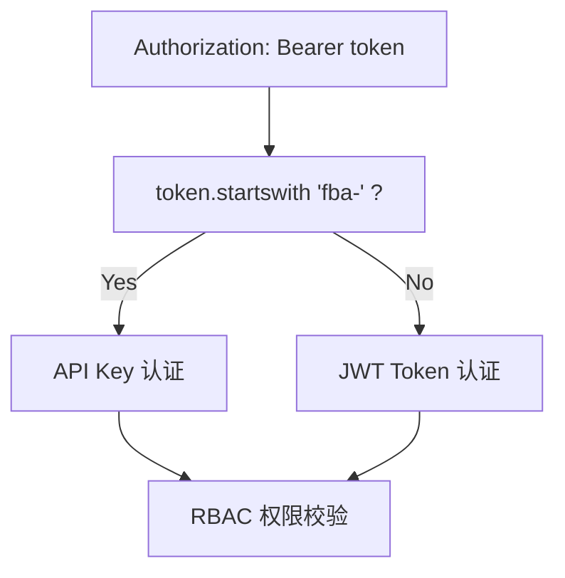

# API Key

用户自定义 API Key 管理，支持生成、管理和使用 API Key 进行接口认证

## 全局配置

在 `backend/core/conf.py` 中添加以下内容：

```python
##################################################
# [ Plugin ] api_key
##################################################
# 基础配置
API_KEY_GENERATE_PREFIX: str = 'fba-'
```

## 使用方式

编辑 `backend/core/registrar.py`，替换 JWT 认证中间件：

```python
# 原来的导入
# from backend.middleware.jwt_auth_middleware import JwtAuthMiddleware

# 替换为
from backend.plugin.api_key.middleware import JwtApiKeyAuthMiddleware

# 原来的 JWT auth
# app.add_middleware(
#     AuthenticationMiddleware,
#     backend=JwtAuthMiddleware(),
#     on_error=JwtAuthMiddleware.auth_exception_handler,
# )

# 替换为
app.add_middleware(
    AuthenticationMiddleware,
    backend=JwtApiKeyAuthMiddleware(),
    on_error=JwtApiKeyAuthMiddleware.auth_exception_handler,
)
```

## 认证流程



## 权限控制

API Key 完全继承用户权限

如需限制权限，只需创建专门的 API 用户：

1. 创建受限角色（如 `API 只读角色`），分配必要权限
2. 创建 API 用户，分配该角色
3. 使用该用户创建 API Key
